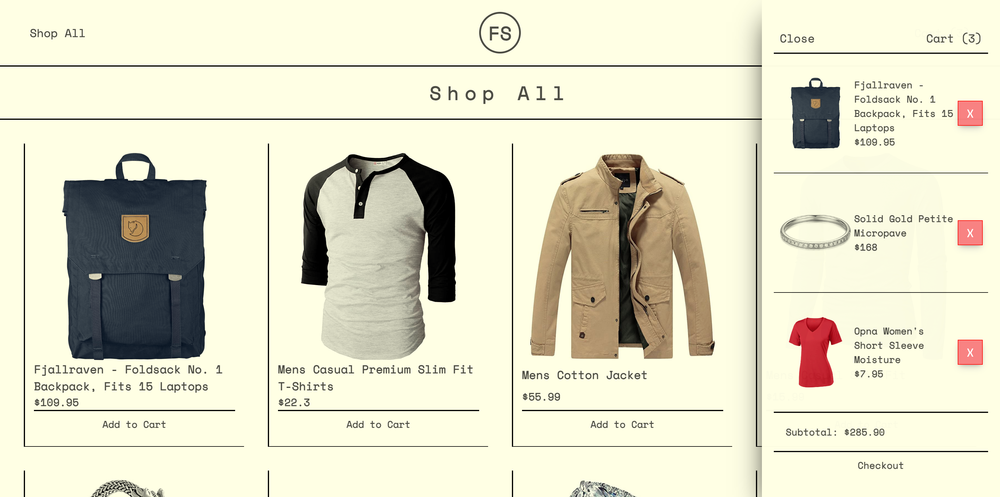

<div align='center'> 
<h1 align='center'> fakestore-ecommerce</h1>
</div>

## About

Front Page

Product Page & Cart

An ecommerce project provided by [The Odin Project](https://www.theodinproject.com/)
[Live demo](https://fakestore-ecom.vercel.app/)

## Built with

- React
- ReactRouter
- [Fake Store API](https://fakestoreapi.com/)
- Vite
- CSS
- HTML

## Features

- Simple catalogue of various products from Fake Store API
- Users can select items to "purchase"
- Users can remove unwanted items
- Cart to hold selected items
- Responsive design

## Development

Getting started on your machine:

1. Clone repository
   ```
   git clone https://github.com/justincbal/ecom-store.git
   ```
2. Navigate to cloned repository

   ```
   cd ecom-store
   ```

3. Install dependencies
   ```
   npm i
   ```
4. Run project
   ```
   npm start
   ```
